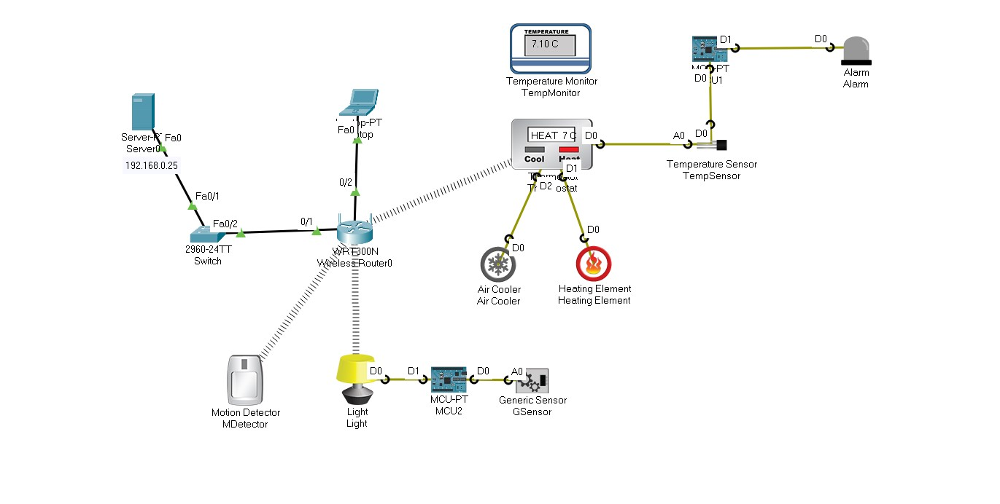

### IOT Smart Home

## Description:

- The system design Smart Home automation system that allows the remote control of temperature and lighting through a web application using Cisco Packet tracer.
 
- The system use (Server-PT ,switch2950-24 and Wireless Router300N) to make secure network (AAA) and control remotely the end-device(Temperature Monitor, Thermostat, MCU ,Motion Detector, Light and alarm)

## Topology:

- 

